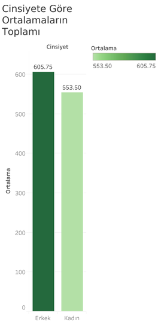
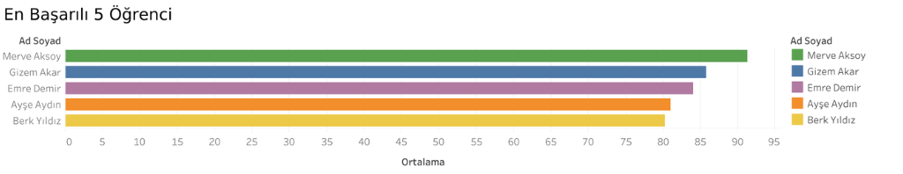

# 🎓 Öğrenci Performans Analizi

Python, SQL (PostgreSQL) ve Tableau kullanılarak oluşturulmuş temel bir veri analizi projesidir.  
Bu proje, 12. sınıf sayısal bölüm öğrencilerinin ders başarılarını analiz ederek görselleştirmeyi hedefler.

## 📁 Klasör Yapısı

'''ogrenci_performans_analizi/
├── 01_notebook_veri_uretimi/
│   └── veri_uretimi_kodu.ipynb
├── 02_veri_dosyaları/
│   ├── ogrenci_verileri_ilk_hali.csv
│   └── ogrenci_verileri_siralanmis.csv
├── 03_sql_sorgulari/
│   └── sql_sorgulari_ogrenci_analizi.sql
├── 04_aciklamali_sql_sorgulari/
│   └── aciklamali_sql_sorgulari.txt
├── 05_gorsel_analiz_grafikleri/
│   ├── Branslara_Gore_Ogrenci_Performans_Oranlari.png
│   ├── Cinsiyete_Gore_Ortalamalarin_Toplami.png
│   └── En_Basarili_5_Ogrenci.png
└── README.md'''

## 🔧 Kullanılan Teknolojiler

- 🐍 Python (Jupyter Notebook üzerinden veri oluşturma ve işleme)
- 🗃️ PostgreSQL + DBeaver (veritabanı ve SQL işlemleri)
- 📊 Tableau (görselleştirme)
- 💻 GitHub (proje yönetimi)

## 🔎 Proje Aşamaları

1. **Python ile Veri Üretimi**  
   - Öğrenci isimleri rastgele oluşturuldu  
   - Ders notları (Matematik, Fizik, Kimya, Biyoloji) rastgele atandı  
   - Ortalama puan hesaplandı ve başarı sırasına göre sıralandı  

2. **SQL ile Sorgulama**  
   - PostgreSQL veritabanına aktarıldı  
   - Öğrenci filtrelemeleri ve başarı sıralamaları SQL ile yapıldı  

3. **Tableau ile Görselleştirme**  
   - Cinsiyete göre toplam ortalamalar 
   - Branşlara göre başarı oranları  
   - En başarılı 5 öğrenci  

## 📊 Grafikler

### 📌 Cinsiyete Göre Ortalamaların Toplamı

### 📌 Branşlara Göre Öğrenci Performans Oranları

### 📌 En Başarılı 5 Öğrenci

## 👤 Hazırlayan

**Yavuzcan ÇOLAK**  
Veri Analizi ve Mühendislik Odaklı Gelişen Bir Kariyer Yolculuğu  

---

📌 Not: Bu proje kişisel portföy amacıyla hazırlanmıştır.  
